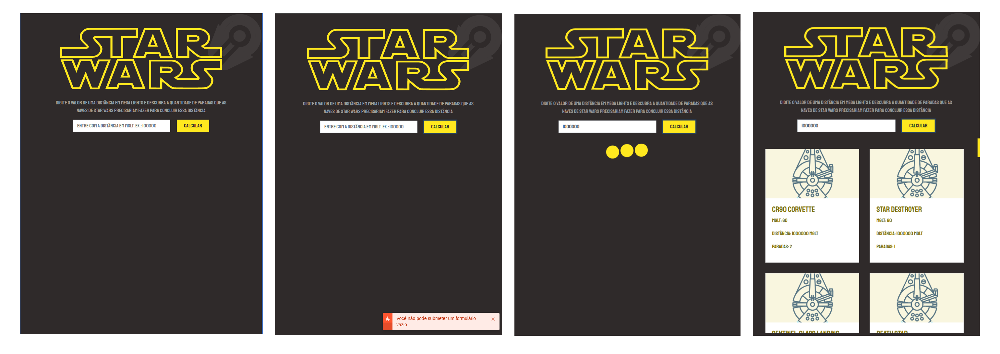

# Star Wars Ships - Calculando a distância

## Desafio

Utilizando a API Star Wars disponível em [https://swapi.dev/](https://swapi.dev/), o aplicativo deve retornar, para uma determinada distância inserida pelo usuário em megaluzes (MGLT), quantas paradas cada espaçonave precisa fazer para completar uma viagem.

## O projeto

O projeto foi realizado com o React JS em conjunto com as bibliotecas:

* `redux`
* `redux sauce`
* `Bootstrap`
* `React Toast Notification`
* `React Spinner`

A API Star Wars foi utilizada para recolher informações das espaçonaves presentes nos filmes de Star Wars.

## Inicializando o projeto

------

Para rodar o projeto é necessário realizar alguns passos

1. Clone o projeto `git clone https://github.com/cdbarbosa/startwars`
2. `yarn install` ou `npm install` para instalar os pacotes necessários
3. `yarn start` ou `npm start` para iniciar o projeto. O projeto irá iniciar em [http://localhost:3000](http://localhost:3000)

## Considerações finais

------

Nessa aplicação foi utilizado o Redux para centralizar os dados, mesmo que simples, do sistema, com o intuito de diminuir a quantidade de requisções para a API. A utilização desse biblioteca foi baseado no modelo *Duck Pattern*, centralizando as ações e estados responsáveis àquele tipo de informação, nesse caso, as informações relacionadas às espaçonaveis.
Apesar de contemplar o pedido proposto pelo desafio, ainda há itens que podem ser implementados para uma melhor performance da aplicação, como Teste unitários E2E (*End to End*) e algumas animações para melhor entreterimento do usuário.

## Implementações Futuras

------

* Teste Unitário E2E utilizando cypress